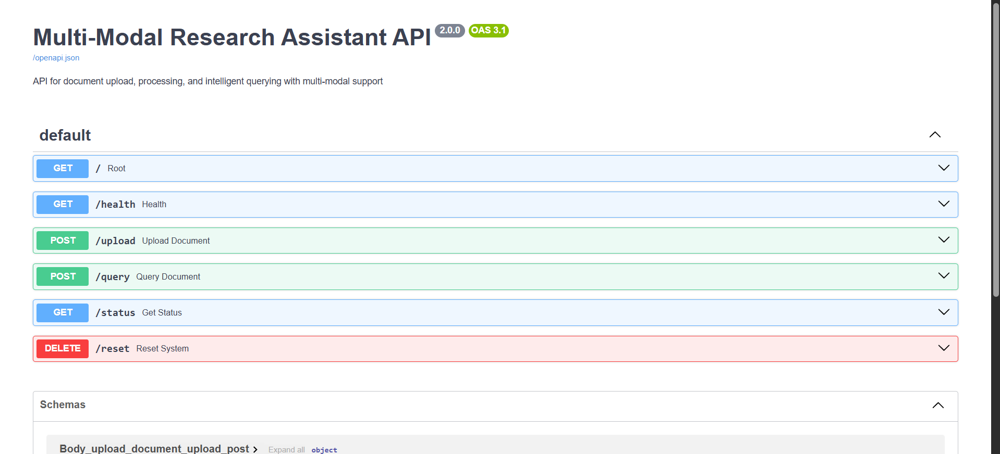
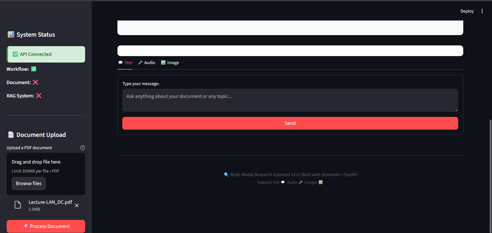

# Multi-Modal-Research-Assistant

### Environment and Download dependencies
```
uv init
uv venv
.venv\Scripts\activate
uv add -r requirements.txt

uvicorn main:app --reload
streamlit run frontend.py
```

## Folder Structure
```
src/ai_component/
├── config.py                 # Configuration and API keys
├── llm.py                    # LLM factory and chain management
├── logger.py                 # Logging configuration
├── exception.py              # Custom exception handling
├── core/
│   └── prompts.py            # System prompts and templates
├── graph/
│   ├── graph.py              # Main workflow graph
│   ├── node.py               # Node implementations
│   ├── state.py              # Graph state management
│   └── edges.py              # Edge definitions
├── modules/
│   ├── RAG/
│   │   └── vector_store.py   # Multimodal RAG implementation
│   ├── audio/
│   │   └── speechTotext.py   # Audio transcription
│   └── image/
│       └── image_to_text.py  # Image analysis
└── tools/
    ├── vector_seach_tool.py  # RAG tool wrapper
    └── mcp_tools/
        ├── web_search_tool.py    # Web search MCP tool
        └── browser_use_tool.py   # Browser automation MCP tool
```


## Features

### Core Capabilities
- Multimodal RAG: Process PDFs with both text and image content using CLIP embeddings
- Web Search: Real-time web search using Serper API
- Academic Research: arXiv paper search and retrieval
- Browser Automation: Control Chrome browser for interactive web tasks
- Audio Processing: Speech-to-text transcription using AssemblyAI
- Image Analysis: Image-to-text processing with Google Gemini Vision
- Workflow Orchestration: LangGraph-based multi-node processing pipeline

### AI Models
- Google Gemini: Primary LLM for text generation and multimodal tasks
- Groq: Alternative LLM option for fast inference
- CLIP: Image and text embedding for multimodal search
- AssemblyAI: Speech recognition and transcription

### Node Functions
- Query Refiner: Enhances and clarifies user queries
- Research Node: Performs web search, arXiv lookup, and browser automation
- Vector Node: Retrieves relevant information from processed documents
- Combined Node: Synthesizes responses from multiple sources

###  Tools Architecture Section
- Detailed explanation of MCP (Model Context Protocol) vs LangChain tools
- Architecture diagrams and integration patterns
- Multi-server MCP configuration examples

### MCP Tools Deep Dive
- Web Search Tool: Serper API integration with structured responses
- Browser Automation Tool: Complete Playwright wrapper with 8 different browser operations
- arXiv Paper Tool: External MCP server integration
- Tool server creation patterns using FastMCP

### LangChain Tools Integration

- RAG Tool: Vector database integration example
- Custom tool creation patterns
- Async/sync tool implementations
- Tool chaining and composition examples


### Monitoring and Logging
- The system includes comprehensive logging:
- Langgsmith is used for tracing
- File Logging: Logs are stored in logs/ directory
- Error Tracking: Custom exception handling with detailed error messages
- Performance Monitoring: Node execution timing and status

## Image



